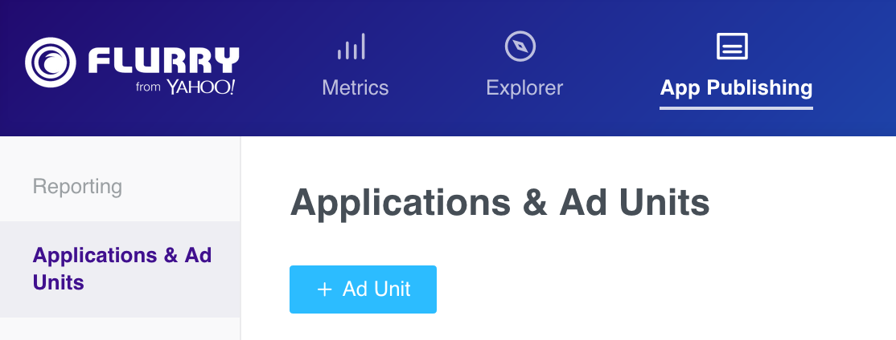
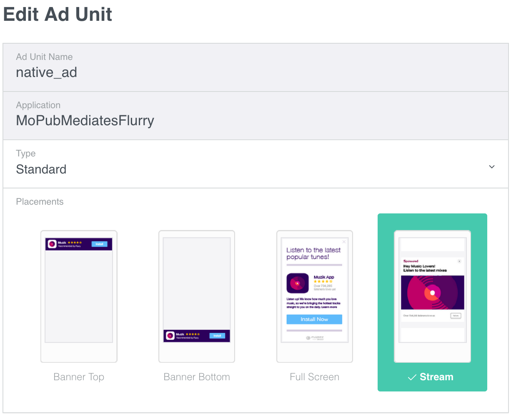

Flurry iOS Adapter for MoPub
============================

Adapter version 7.6.6 - Updated 2016-08-29
------------------------------------------

This version of the adapter works with MoPub iOS SDK 4+. If using older versions of the MoPub SDK, please refer to
[version 7.2.0](https://github.com/flurry/FlurryAdapterForMoPubiOS/tree/v7.2.0_for_mopub_pre_4.0.0) of the adapter.


###  Mediate Flurry Ads through MoPub

To integrate Flurry as a Custom Network in your MoPub ad serving flow, you need the
Custom Event Class code incorporated into your application, in addition to the Flurry SDK.
Three quick steps are necessary:

1. Integrate the Flurry SDK and Flurry adapter for MoPub code into your app
2. Configure Flurry's Ad Unit(s)
3. Configure MoPub to mediate Flurry

#### Integrate the Flurry SDK and Flurry adapter for MoPub code into your app

1. If your application is not yet using Flurry analytics, create a new application on Flurry's
dev portal. After logging into https://y.flurry.com, click the **Admin**  tab and go to the **Applications** page.
From this page, click the **New App** button to go through the process of adding a new app. Take note of the API key
generated for your app, as that would be useful when configuring a new ad unit on MoPub. 

    

2. [Add the Flurry SDK](https://developer.yahoo.com/flurry/docs/integrateflurry/ios/#import-flurry-libraries) to 
your Xcode project.

3. From the Flurry dashboard, record the API key for your iOS project. This will identify your app in the Flurry system.

4. Add the Flurry adapter classes for MoPub to your project. The main file needed for all ad types is `FlurryMPConfig.(h|m)`

5. Follow the [MoPub Custom Event integration steps](https://github.com/mopub/mopub-ios-sdk/wiki/Integrating-Third-Party-Ad-Networks)
for integrating banner and interstitial ads.

   The necessary files for banner and interstitial mediation should have already been added in step 3. These files are:
    * `FlurryBannerCustomEvent.(h|m)`
    * `FlurryInterstitialCustomEvent.(h|m)`

6. The steps to integrate Flurry Native Ads via MoPub are similar to those described [here](https://github.com/mopub/mopub-ios-sdk/wiki/Integrating-Native-Third-Party-Ad-Networks):

   The necessary files for native mediation files are:
    * `FlurryNativeCustomEvent.(h|m)`
    * `FlurryNativeAdAdapter.(h|m)`
    * `FlurryNativeVideoAdRenderer.(h|m)`
 
 If using Flurry native video ads, you will need to include the Flurry native video renderer configuration when making your ad request:

 ```objc
 // Create Flurry video renderer configuration
 MOPUBNativeVideoAdRendererSettings *nativeVideoAdSettings = [[MOPUBNativeVideoAdRendererSettings alloc] init];
 MPNativeAdRendererConfiguration *flurryNativeVideoConfig = [FlurryNativeVideoAdRenderer 
                                                             rendererConfigurationWithRendererSettings:nativeVideoAdSettings];

 // Include the video setting into your ad Request
 MPNativeAdRequest *adRequest = [MPNativeAdRequest requestWithAdUnitIdentifier:@"yourAdUnitId" 
                                                        rendererConfigurations:@[flurryNativeVideoConfig /*, add other native config */]];
 ```

 While the Flurry native video renderer can handle both static and native video ads, if you are not using video ads, all you need to do is to
 add Flurry as a supported custom event to the MoPub SDK.

 ```objc
 MPNativeAdRendererConfiguration *nativeAdConfig = [MPStaticNativeAdRenderer rendererConfigurationWithRendererSettings:nativeAdSettings];
 nativeAdConfig.supportedCustomEvents = @[@"MPMoPubNativeCustomEvent", 
                                          @"FlurryNativeCustomEvent" /*, add other custom events your app needs */];
 ```

#### Configure Flurry Ad Unit(s)

For each MoPub ad unit that you would like to mediate Flurry through, please create a matching ad
unit on the [Flurry dev portal](https://y.flurry.com). Log into the developer portal and navigate
to the **App Publishing** tab. On the lefthand navigation bar select **Applications & Ad Units** to
view a list of your ad units.



To set up a new ad unit, click on the **Ad Unit** button on the top right.

The Basic Setup section includes fields required to define the Ad Unit Name, application,
placement and/or orientation of the ad unit.



The basic setup is all you need for most integrations and you can click the "Submit" button.

Please note that mediating Flurry through MoPub requires no additional Flurry-related code.
The Flurry Advertising code is already incorporated in this adapter's code.

#### Configure MoPub to mediate Flurry

Flurry's custom events are implemented in accordance with [instructions provided by MoPub](https://github.com/mopub/mopub-ios-sdk/wiki/Custom-Events).

After you incorporate the Flurry files into your project, you need to configure Flurry as a Custom Network. 
Please follow instructions provided by MoPub 
(for [banner, interstitial](https://dev.twitter.com/mopub/ui-setup/custom-network-setup) or [native](https://dev.twitter.com/mopub/ui-setup/network-setup-custom-native)) 
with any of the Flurry custom events class noted below:

* [`FlurryBannerCustomEvent`](FlurryBannerCustomEvent.h) for banner ads
* [`FlurryInterstitialCustomEvent`](FlurryInterstitialCustomEvent.h) for interstitial ads
* [`FlurryNativeCustomEvent`](FlurryNativeCustomEvent.h) for Flurry native ads

**NOTE:** An important step to get this integration working is to configure the custom network (as described above) with the
Flurry API key and Flurry Ad Unit and send them as server extras (in the "Custom Event Class Data" field on the MoPub UI).

The custom event class data should be in the following JSON format:

```json
{"apiKey":"YOUR_API_KEY","adSpaceName":"YourAdUnitName"}
```

You can also configure the custom event data as a line item in your MoPub order.


For full integration instructions to mediate Flurry through MoPub see 
[here](https://developer.yahoo.com/flurry/docs/publisher/mediation/mopub/ios/). 
For more info on getting started with Flurry for iOS, see
[here](https://developer.yahoo.com/flurry/docs/integrateflurry/ios/)
and for more info on monetizing you app through Flurry see 
[here](https://developer.yahoo.com/flurry/docs/publisher/code/ios-ad-publishing/).

Changelog
---------
#### Version 7.6.6 - 2016-08-29
* Added support for Flurry native video ad rendering

#### Version 7.5.1 - 2016-03-03
* Changes to the way API keys are injected into the adapter. API keys can now be sent as part of the MoPub ad unit configuration. See ["Configure Flurry Ad Unit(s)"](#configure-flurry-ad-units)
* Bug fixes regarding extra assets passed unto MoPub
* Fixed a bug preventing Flurry from notifying the interstitial ad delegate of some events.

#### Version 7.2.1 - 2015-10-22
* Compatibility with MoPub 4+

#### Version 7.2.0.r1 - 2015-09-30
* Added support for CTA and app star rating
